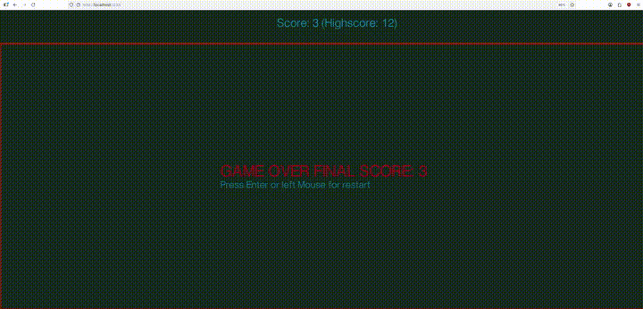

# 2D Snake Game

A classic 2D snake game built with Tiramisu game engine in Gleam!
Uses local storage to store the highscore


## Running the Game

```bash
gleam run -m lustre/dev start
```

Then open your browser to the URL shown (typically http://localhost:1234)

## Controls

- **Arrow Keys** or **WASD**: Change snake direction

## Gameplay

- Eat the **red yellow rectangle** to grow and increase your score
- Don't hit the **walls** (grid boundaries)
- Don't run into **yourself**
- Try to beat the highscore

## What You Should See

- **Score display** on the top, with optional highscore

## Troubleshooting

If you only see a solid color screen:
1. Open browser console (F12) and check for JavaScript errors
2. Verify Three.js is loading from the CDN (check Network tab)
3. Make sure the game compiled without errors
4. Try refreshing the page
